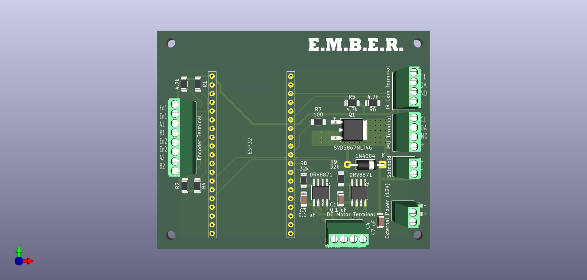
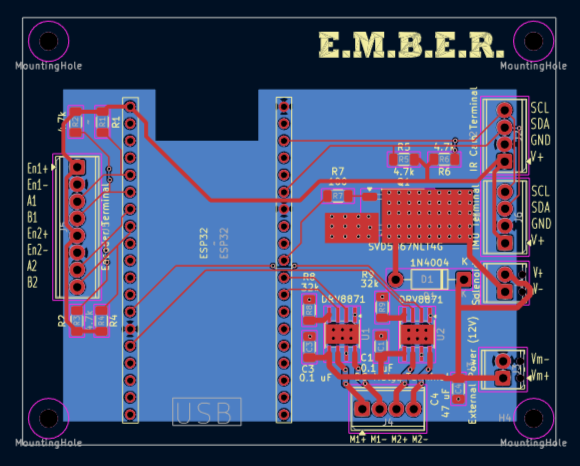
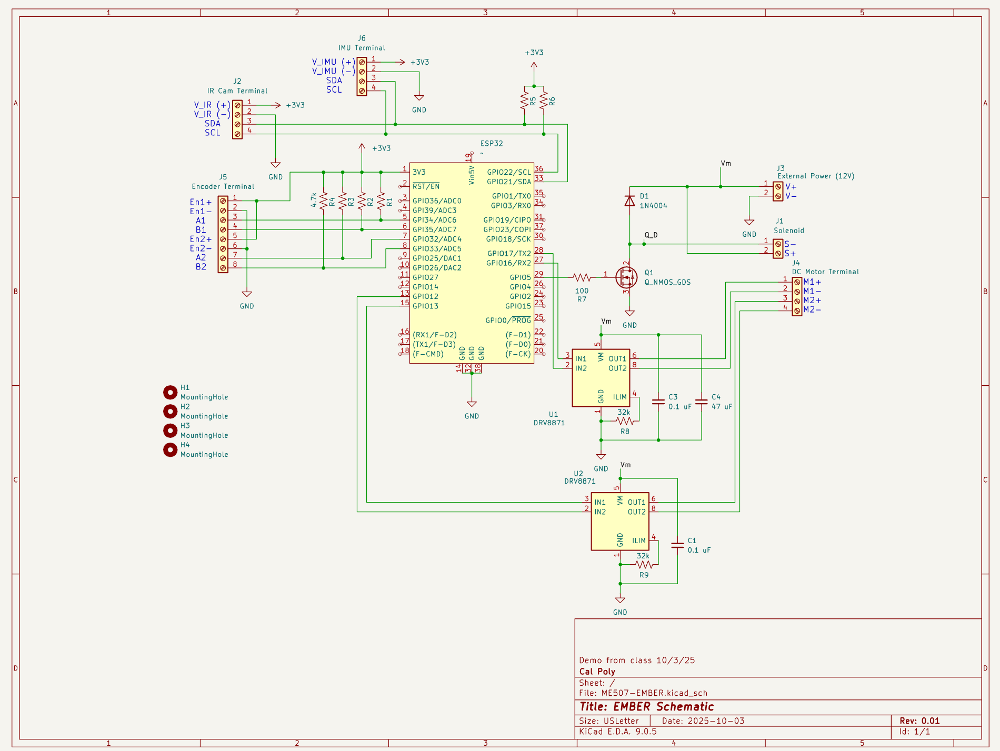

# EMBER Board Design

This folder contains the schematic and pcb files for EMBER.

The board has the following terminals for connection to hardware:

| Terminal | Description |
| --- | --- |
| ESP32 Pin Connector | 28 pin connector for connection of ESP32 to the board. |
| Encoder Terminal | 8 position terminal for connection to the 2 motor quadrature encoders. Has 3.3V+ and gnd output for both terminals denoted by Eni+ and Eni- respectively. Has inputs for channels A and B. |
| DC Motor Terminal | 4 position terminal to connect the 2 motors. Ensure that motor 1's encoder is connected to channels A1 and B1 on the encoder terminal, and motor 2's encoder is connected to channels A2 and B2 on the encoder terminal. |
| IR Cam Terminal | 4 position terminal for I2C connection to the MLX90640 Thermal IR Camera. Has 3.3V+ and gnd output and SDA/SCL input. |
| IMU Terminal | 4 position terminal to support an additional I2C peripheral, for instance an IMU. Has 3.3V+ and gnd output and SDA/SCL input. |
|Solenoid | 2 position terminal for connection to the Solenoid. Outputs Vm+ and Vm- using a MOSFET controlled by the microcontroller with a flyback diode circuit. |
| External Power (12V) | 2 position terminal for connection to battery. Vm+ should be ~12V+ and Vm- should be gnd. |

### Board

## Schematic

## Board Componenets

### 1. ESP32 NODEMCU-32S ESP-32S Kit x1
Main microcontroller for project - AliExpress: [NodeMCU ESP-32S](https://www.aliexpress.us/item/3256803993966716.html?aff_fcid=af0d56b72584400e939c5846a142b640-1765257992709-07791-_DekJaq1&tt=CPS_NORMAL&aff_fsk=_DekJaq1&aff_platform=shareComponent-detail&sk=_DekJaq1&aff_trace_key=af0d56b72584400e939c5846a142b640-1765257992709-07791-_DekJaq1&terminal_id=c19409dd1363429c8f1fb5e260b0cc2d&afSmartRedirect=y&gatewayAdapt=glo2usa4itemAdapt)

### 2. DRV8871DDAR - Motor Driver x2
Motor driver with 2 inputs from controller for PWM control - Texas Instruments: [DRV8871DDAR](https://www.digikey.com/en/products/detail/texas-instruments/DRV8871DDAR/5639726)

### 3. 1N4004 Diode
Flyback Diode for Solenoid/MOSFET circuit : [1N4004-E3/54](https://www.digikey.com/en/products/detail/diotec-semiconductor/1N4004/13164524)

### 4. MOSFET N-CH x1
MOSFET to turn solenoid on/off from microcontroller N-Channel 60 V 22A (Tc) 3.3W (Ta), 43W (Tc) - Onsemi: [SVD5867NLT4G](https://www.digikey.com/en/products/detail/onsemi/SVD5867NLT4G/3062534)

### 5. 100kΩ Resistor x1
Resistor between microcontroller and MOSFET gate - Vishay Dale: [TNPW1206100RBEEA](https://www.digikey.com/en/products/detail/vishay-dale/TNPW1206100RBEEA/1607739?s=N4IgTCBcDaICoDkAKBGADGgggYW3AtAgCIgC6AvkA)

### 6. 4.7kΩ Resistor x6
Pullup Resistors for I2C circuit and Encoder Channels - YAGEO: [RC1206FR-074K7L](https://www.digikey.com/en/products/detail/yageo/RC1206FR-074K7L/728887?s=N4IgTCBcDaIMwEYEFoAsA6A7ABgNIDEAlAYQBVkA5AERAF0BfIA)

### 7. 32kΩ Resistor x2
Current limit resistor for motor drivers (limitting to 2A, under the motor stall current to protect motors) - KOA Speer Electronics, Inc: [RN73H2BTTD3202F100](https://www.digikey.com/en/products/detail/koa-speer-electronics-inc/RN73H2BTTD3202F100/10098378?s=N4IgTCBcDa4AwEYCcBaASgOQOwGYASYAQgCrEAiOYcYAYgnHAMLEoZkgC6AvkA)

### 8. 47μF Capacitor x1
Filter capacitor for motor drivers - TDK Corporation: [C3216X5R1E476M160DC](https://www.digikey.com/en/products/detail/tdk-corporation/C3216X5R1E476M160DC/22106052?s=N4IgTCBcDaICxwKwFoDCBmMBGAbADUQCUsBROAdhwFlcAGAEVVQBVkA5ekAXQF8g)

### 9. 0.1μF Capacitor x2
Filter capacitor for motor drivers - KEMET: [C1206C104K5RACTU](https://www.digikey.com/en/products/detail/kemet/C1206C104K5RACTU/411248?s=N4IgTCBcDaIMwE4EFoDCBGMAGAbBrALANICsASgIKoAqAqjcgHIAiIAugL5A)

### 10. 2 Position Screw Terminal x2
12V power in and Solenoid power out terminals - Phoenix Contact: [1725656](https://www.digikey.com/en/products/detail/phoenix-contact/1725656/267462)

### 11. 4 Position Screw Terminal x3
I2C connections (2 were added for potential to integrate another I2C peripheral such as an IMU, although only 1 is used for Thermal IR camera), and motor output connection - Phoenix Contact: [1725672](https://www.digikey.com/en/products/detail/phoenix-contact/1725672/267464)

### 12. 8 Position Screw Terminal x1
Encoder connections - Phoenix Contact: [1725711](https://www.digikey.com/en/products/detail/phoenix-contact/1725711/267468)
